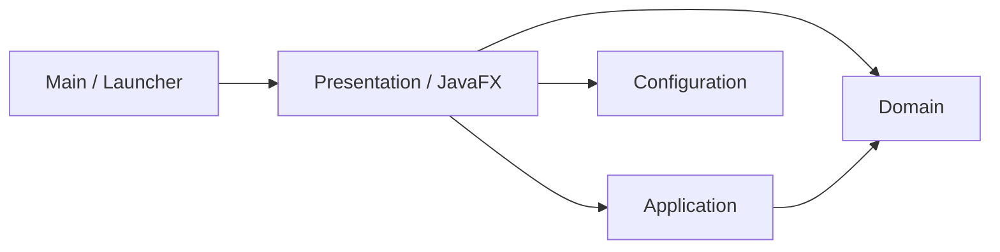

# Arquitetura do Escape Lab

## Objetivo

O projeto usa uma Clean Architecture enxuta. As regras do jogo permanecem independentes do JavaFX, enquanto detalhes de janela, teclado, loop e desenho ficam na camada mais externa.

Não há framework de injeção de dependências, repositórios vazios ou interfaces sem necessidade. A montagem das dependências é explícita e feita pelo composition root.

## Direção das dependências



As setas representam dependências de código permitidas. Camadas externas podem acessar camadas internas diretamente, mas uma camada interna nunca importa uma camada externa: o domínio não conhece a aplicação, e a aplicação não conhece a apresentação.

## Camadas

### Domain

Contém entidades, valores e regras do jogo:

- `Player`: estado e movimento do jogador.
- `Position`: posição imutável no mundo.
- `Direction`: vetor de direção com magnitude limitada a um.
- `WorldBounds`: limites e restrição de posições.

Esta camada usa apenas a biblioteca padrão do Java.

### Application

Coordena os casos de uso e define portas:

- `GameSession`: executa a atualização da partida.
- `GameEngine`: coordena tempo, atualização, snapshot e saída de cada frame.
- `MovementInput`: porta usada para consultar a intenção de movimento.
- `GameOutput`: porta pela qual o frame pronto é entregue à apresentação.
- `GameSnapshot`: estado imutável entregue à apresentação.
- `FrameClock`: separa tempo real do delta limitado da simulação.
- `FpsCounter`: calcula FPS sem depender do relógio do sistema.

Ela depende do domínio, mas não conhece JavaFX.

### Presentation / JavaFX

Implementa os adapters externos:

- `EscapeLabApplication`: composition root e ciclo de vida da janela.
- `JavaFxGameLoop`: adapta o `AnimationTimer` ao fluxo da aplicação.
- `KeyboardInput`: converte teclas em `Direction`.
- `CanvasGameRenderer`: coordena os renderizadores do cenário, jogador e HUD.

Toda referência a `javafx.*` deve permanecer nesta camada.

### Configuration

`GameConfiguration` centraliza parâmetros usados na montagem do protótipo. Viewport e mundo possuem nomes separados, mas devem manter o mesmo tamanho enquanto não existir uma câmera que faça a transformação entre os dois espaços.

## Fluxo de um frame

```text
AnimationTimer
    → JavaFxGameLoop
    → GameEngine
    → FrameClock
    → KeyboardInput
    → GameSession.update(delta)
    → Player.move(...)
    → GameSession.snapshot()
    → CanvasGameRenderer
```

O renderer recebe um snapshot imutável. Assim, desenhar a tela não consegue modificar o estado da partida.

## Regras protegidas por testes

O `CleanArchitectureTest` usa ArchUnit para garantir automaticamente que:

- `domain` depende somente de `domain` e do JDK;
- `application` depende somente de `application`, `domain` e do JDK;
- JavaFX permanece dentro de `presentation.javafx`;
- os pacotes de alto nível não formam ciclos.

## Como evoluir o projeto

Funcionalidades novas devem respeitar as mesmas fronteiras:

- Tiles, entidades, estados dos inimigos e regras de percepção pertencem ao domínio.
- Movimento com colisão, perseguição e interação com cartões pertencem à aplicação.
- Arquivos de mapa, áudio e persistência entram como adapters externos.
- Canvas, teclado, câmera e telas continuam na apresentação JavaFX.

Evite pacotes genéricos como `utils`, `helpers` ou `managers`. Dê a cada classe um nome que descreva claramente sua responsabilidade.
